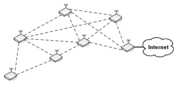
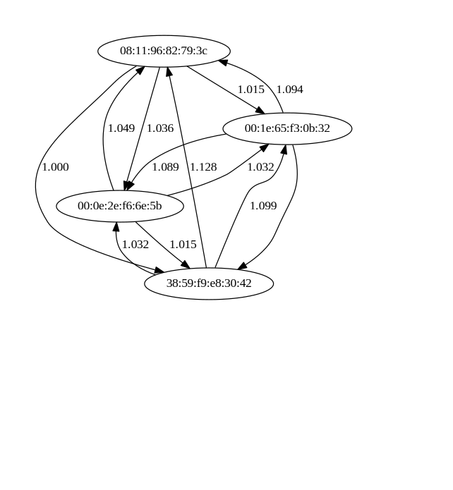
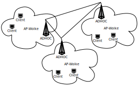

Meshnetzwerke - Workshop
========================

----

802.11 Modi AP + Station
========================

IEEE-Norm für Kommunikation in Funknetzwerke (WLAN)

Access point
------------

* WLAN-Zugangsknoten (AP) für Endgeräte (Handys, Laptops)
* zentralistisch, hierachisch
* Infrastrukturknoten

Station Mode
------------

* Client-Modus um eine Verbindung mit einem AP aufzubauen
* Endgeräte wie Handys und Laptops vebinden sich so mit APs

----

802.11 Modi Ad-hoc
==================

Ad-hoc (IBSS - Independent Basic Service Set)
---------------------------------------------

* Netzknoten stellen selbst die Infrastruktur da
* hierachieloses dezentrales Netz
* jeder Knoten ist selbst ein Infrastrukturknoten
* zusammenhängede Netze werden anhand der BSSID identifiziert

----

Meshnetzwerk mit Linux
======================

----

IPv4 Grundwissen
==============

Eine IPv4-Adresse besteht aus zwei Teilen:

1. Netzwerk (oft durch Netzmaske definiert)
2. Host

**Beispiel**

*192.168.1*. **1** (kursiv Netzwerk-, fett Hostteil)

* Adresse: 192.168.1.1
* Netzmaske: 255.255.255.0

Cidr-Notation
-------------

Angabe des Netzwerkteils (Netzwerkmaske) mit einer sogenannte Präfixlänge.
Die Präfixlänge gibt die Anzahl der Bits der Netzmakse an.

**Beispiel: 192.168.1.1/24**

* Adresse in Bits: 11111111.11111111.11111111.0000000
* HostMin: 192.168.1.1, HostMax: 192.168.1.254

----

Netzwerk Tools
==============

ipcalc
------

::

  $ ipcalc 10.0.0.1/8
  Address:   10.0.0.1             00001010. 00000000.00000000.00000001
  Netmask:   255.0.0.0 = 8        11111111. 00000000.00000000.00000000
  (...)
  HostMin:   10.0.0.1             00001010. 00000000.00000000.00000001
  HostMax:   10.255.255.254       00001010. 11111111.11111111.11111110
  Broadcast: 10.255.255.255       00001010. 11111111.11111111.11111111
  Hosts/Net: 16777214              Class A, Private Internet

ip
---

show / manipulate routing, devices, policy routing and tunnels

::

  $ apt-get install ip
  $ ip addr add 10.0.0.1/8 broadcast 10.255.255.255 dev wlan0
  $ ip addr del 10.0.0.1/8 dev wlan0
  $ ip route show
  $ ip link set dev wlan0 up
  $ ip link set dev wlan0 down

iw
--

show / manipulate **wireless** devices and their configuration

::

  $ apt-get install iw
  $ iw dev wlan0 info
  $ iw dev wlan0 link

----

Ad-hoc Netzwerke
================

Ad-hoc Untersützung überprüfen
------------------------------

::

  $ iw phy | grep -A 13 Frequencies
      Frequencies:
        * 2412 MHz [1] (15.0 dBm)
        * 2417 MHz [2] (15.0 dBm)
        * 2422 MHz [3] (15.0 dBm)
        * 2427 MHz [4] (15.0 dBm)
        * 2432 MHz [5] (15.0 dBm)
        * 2437 MHz [6] (15.0 dBm)
        * 2442 MHz [7] (15.0 dBm)
        * 2447 MHz [8] (15.0 dBm)
        * 2452 MHz [9] (15.0 dBm)
        * 2457 MHz [10] (15.0 dBm)
        * 2462 MHz [11] (15.0 dBm)
        * 2467 MHz [12] (15.0 dBm) (passive scanning, no IBSS)
        * 2472 MHz [13] (15.0 dBm) (passive scanning, no IBSS)

Keine Anmerkung bedeutet Treiberunterstützung für IBSS / Ad-hoc

----

Ad-hoc Netzwerke erstellen / beitreten
======================================

Network Manager
---------------

.. .. image:: network_manager_adhoc.svg

Missing image network_manager_adhoc.svg

----

Ad-hoc Netzwerke erstellen / beitreten
======================================

Shell
-----

Networkmanager oder ähnliches ausschalten

::

  $ systemd stop NetworkManager.service
  beziehungsweise
  $ /etc/init.d/networkmanager stop

Adhoc mit ESSID *test-mesh* und BSSID *ca:ff:ee:ca:ff:ee* erstellen auf der
Frequenz 2457 (Channel 10):

::

  $ iw wlan0 set type ibss
  $ iw wlan0 ibss join test-mesh 2457 ca:ff:ee:ca:ff:ee

Debugging
---------

Logdateien überprüfen oder Treiber neuladen

::

  $ dmesg
  $ modprobe -r iwldvm iwlwifi && modprobe iwlwifi  # für Intel Chipsätze

----

Routing
=======

Um Ad-hoc-Knoten in nicht direkter Funkverbindung zu erreichen, braucht
es einen Routingalgorithmus:

Better Approach To Mobile Adhoc Networking (B.A.T.M.A.N. advanced)
------------------------------------------------------------------

* Layer 2 routing protocol
* Teil des Linux Kernels seit 2.6.38
* http://www.open-mesh.org/projects/batman-adv/wiki

Optimized Link State Routing Protocol (olsr)
--------------------------------------------

* Layer 3 routing protocol
* user space daemon
* http://www.olsr.org/

----

B.A.T.M.A.N. advanced
=====================

----

batman-adv
==========

Info
----

* jeder Knoten hat kennt nur einen Ausschnitt des Meshs
* Layer 2

Funktionsweise
--------------

to add

----

batman-adv - HowTo (Linux only)
===============================

1. batman-adv userland tools installieren

   ::

     $ apt-get install batctl

2. batman-adv Kernelmodul laden

   ::

     $ modprobe batman-adv

3. Wireless Interface hinzufügen

   ::

     $ batctl if add wlan0

4. Batman-adv Knoten im Mesh auflisten

   ::

     $ batctl originators

----

batman-adv - Visualisierung
-------------------------

::

  $ batctl vis_mode server
  $ batctl vis_data dot -T -2 | dot -Tpdf -obatman-adv.pdf

----

OLSR
====

----

OLSR
====

Infos
-----

* *link state routing*-Protokoll (Link-Quality entscheidend für das Routing)
* Layer 3

Funktionsweise
--------------

1. **Hello**-Nachrichten an alle 2-Hop Nachbarn
2. Berechnung der Menge von **Multipoint Relays** (MPR) über die es jeden
   2-Hop-Nachbar erreichen kann.
3. Austatusch der MPR-Sets im Mesh mittels **Topology Control**-Nachrichten

Die Routingenscheidung wird auf Basis dieser Informationen via Dykstra's 
**shortest path**-Algortihmus berechnet.

----

OLSR - HowTo
============

1. Olsrd installieren

   ::

     $ apt-get install olsrd       # Debian/Ubuntu
     $ yaourt olsrd                # ArchLinux
     $ brew install olsrd          # Mac OS

2. OLSRD konfigurieren

   ::

    $ vim /etc/olsrd/olsrd.conf

3. Olsrd starten

   ::

     $ olsrd -d 1 -f olsrd.conf

----

OLSR - Smart Gateway
====================

Problem: Abbrechende Verbindungen ins Internet
----------------------------------------------

* OLSR wählt als Internet-Gateway immer den Knoten mit dem besten ETX-Wert aus.
* Packete wechseln zwischen Internet-Gateways mit ähnlich guten ETX-Werten

Smart Gateway: fester IPIP-Tunnel
---------------------------------

Aufbau eines IPIP-Tunnels zu einem Internet-Gateway um ständigen Gateway-Wechsel
zu vermeiden.

Einzustellen in **olsrd.conf**:

::

  (...)
  SmartGateway yes
  (...)

----

Freifunk
========

----

.. raw:: html

  <iframe src="http://player.vimeo.com/video/64814620" width="100%" height="500px" frameborder="0" webkitallowfullscreen mozallowfullscreen allowfullscreen></iframe>

----

Freifunk
========

Wieso?
------

* dezentrale Netzwerke von Menschen und nicht kommerziellen Firmen
* Vernetzung von Menschen im Kiez
* freies Internet in der ganzen Stadt

Funktionsweise
--------------

* jeder Router verbindet sich mit Routern in der Umgebung
* alle Router bieten ein offenes (unverschlüsseltes) WLAN Netz an

----

.. Comparison home wifi and freifunk
.. =================================
.. 
.. home wifi router
.. ----------------
.. an encrypted (WPA-PSK) access point
.. 
.. * encryption prevents access to your network
.. * sniffing your data in the air is hard but goverments or backbone carriers have
..   access to it and monitor you anyway
.. 
.. freifunk router
.. ---------------
.. * unencrypted public access point
.. 
..   * everyone can connect
..   * your data will be sniffable in the air
.. 
.. * routers connect to nearby routers via adhoc interfaces
.. 
.. 
.. **On both scenarios you have to rely on end-to-end encryption like TLS (HTTPS)**
.. 
.. 
.. ----

Netz-Architektur
================

* Jeder Infrastruktur-Knoten (Router) hat zwei Netze
   * Ad-hoc zur Kommunikation mit anderen Routern
   * AP für die Endgeräte

----

Freifunk statt Angst
====================

ISP
---

Der Föderverein Freie Netzwerke e.V. ist seit geraumer Zeit selbst ein *Internet
service provider*.

::

  $ whois -i origin AS44194

  % Information related to '77.87.48.0/21AS44194'
  
  route:          77.87.48.0/21
  descr:          Freifunk Berlin
  origin:         AS44194
  mnt-by:         FREIFUNK-BERLIN-MNT
  source:         RIPE # Filtered
  
  % Information related to '2001:bf7::/32AS44194'
  
  route6:         2001:bf7::/32
  descr:          Foerderverein Freie Netzwerke e.V.
  origin:         AS44194
  mnt-by:         ALL-MNT
  mnt-by:         IN-BERLIN-MNT
  source:         RIPE # Filtered

VPN
---

Um die Störerhaftung zu umgehen und dennoch euren Internetanschluß für das
Freifunknetz freizugeben, gibt es kostenlose VPN-Dienste wie zBsp
http://vpn03.berlin.freifunk.net über den oben genannten Freifunk ISP

----

Pberg-Freifunk Firmware
=======================

Basiert auf OpenWRT mit extra Freifunk-Packeten

* Stable: http://download.berlin.freifunk.net/attitude_adjustment/
* Testing: http://firmware.berlin.freifunk.net/barrier_breaker/

Freifunk Wizard
---------------

Konfiguriert alle Adhoc und virtuellen APs

Freifunk VPN-Wizard
-------------------

Konfiguriert dein OpenVPN sowie Policy Routing

----

Fragen?
=======

